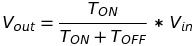

# PWM

Pulse Width Modulation (PWM) is a method to generate time average DC voltage by varying duty cycle and/or frequency of square wave. It can be cosidered as a simple ON and OFF operation of digital switch. By controlling "ON" and "OFF" period of switch, average DC voltage can be changed.

Consider a GPIO pin that is toggled between ON (3.3V) and OFF (0V) state. PWM signal can be generated by changing "ON" and "OFF" time.

Average DC voltage given by PWM signal:

`
