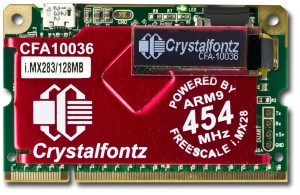
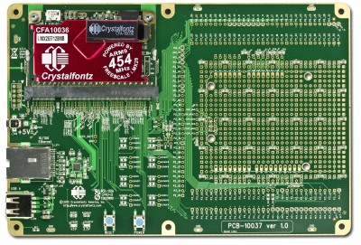

# CFA10036

[CFA10036](http://www.crystalfontz.com/product/CFA10036) is a linux SOM developed by [Crystalfontz America Inc](http://www.crystalfontz.com/).

###Features

* 454MHz Freescale i.MX283 (optionally i.MX287) processor:
 * 16-Kbyte instruction cache, 32-Kbyte data cache
 * 2x CAN interfaces (i.MX287 only)
 * Four synchronous serial ports
 * 10/100-Mbps	802.3 Ethernet MAC (1x on i.MX283, 2x on i.MX287)
 * USB 2.0	OTG (connected to microUSB AB on CFA-10036)USB 2.0	host controller and PHY
 * 5x UART plus one dedicated debug UART
 * 2x I2C (OLED shares one of these)
 * LCD, touch screen, keypad, and rotary encoder support
 * RTC	with 32KHz crystal (requires continuous power)
 * 4x 32-bit timers
 * 8x PWM
 * 5x 12-bit 428KS/s ADC channels
 * 1x 12 bit 2MS/s ADC channel
* 128MB(optionally 256MB) DDR2
* MicroSD/microSDHC/microSDXC	socket: up to 64GB of nonvolatile storage
* 91 GPIO (i.MX283) or 126 GPIO (i.MX287)
* 6-layer	impedance-controlled PCB, gold SODIMM contacts
* On-board micro USB AB connector
* Only a single 5v supply needed (3.3v/1.8v/1.5v supplies internally generated)

# CFA10037

[CFA10037](http://www.crystalfontz.com/product/CFA10037.html) is used as a breakout board for prototyping.

###Features

* Area to plug Arduino Uno R3 shields is provided.
* Ethernet PHY
* USB type A connector
* 0.1" spaced headers to access CFA10036 pins

