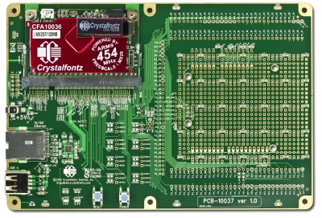

# CFA10037

[CFA10037](http://www.crystalfontz.com/product/CFA10037.html) is used as a breakout board for prototyping.

###Features

* Area to plug Arduino Uno R3 shields is provided.
* Ethernet PHY
* USB type A connector
* 0.1" spaced headers to access CFA10036 pins

